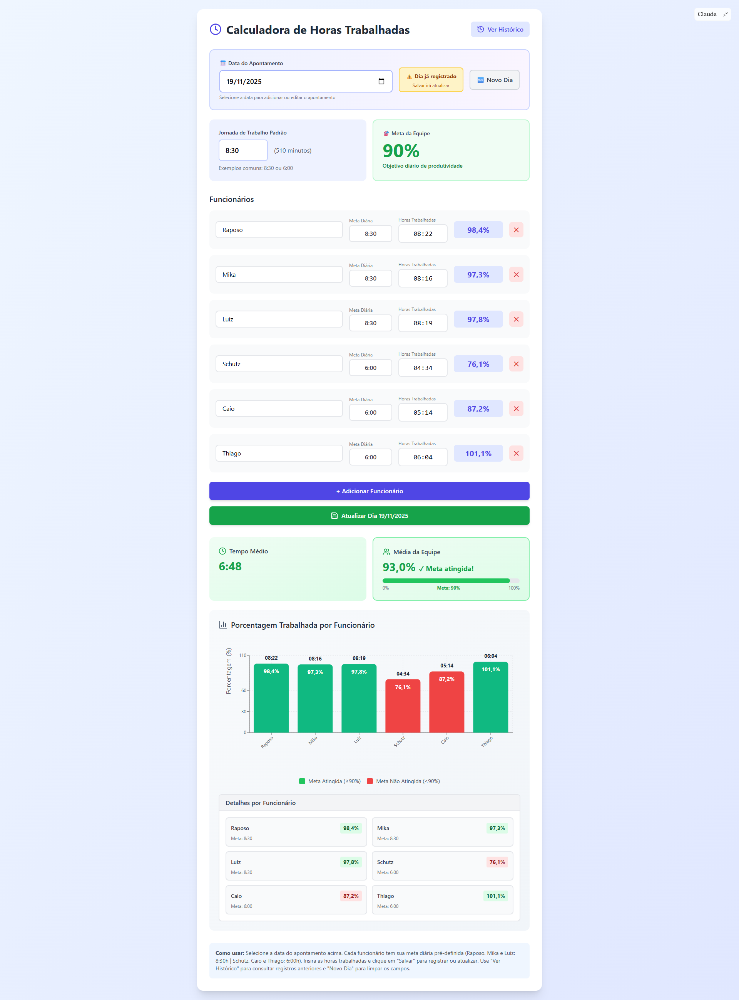
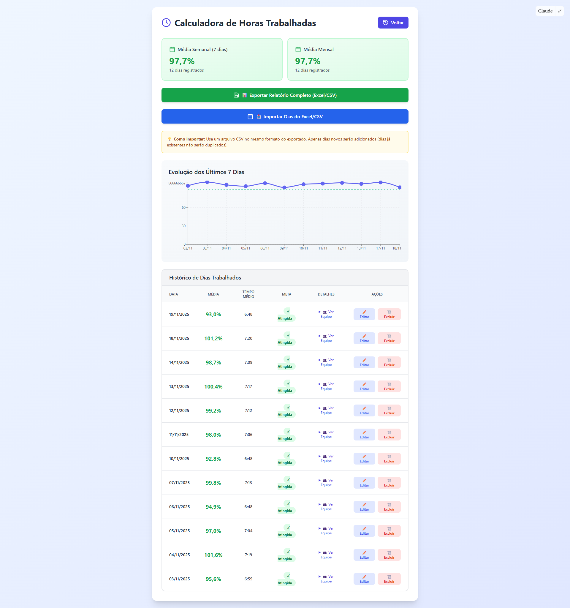

# 📊 Calculadora de Horas Trabalhadas

Aplicação desenvolvida em **React + Tailwind + Recharts** para auxiliar no controle diário de horas trabalhadas, cálculo de produtividade individual e média, registro histórico e exportação/importação de dados.

Ideal para equipes de **QA, Suporte, Operações e Tecnologia**.

---

## 🖼 Interface da Aplicação

### 👉 Tela Principal (Cadastro e cálculo do dia)


### 👉 Tela de Histórico e Relatórios


---

## 🚀 Funcionalidades

### 🕒 Registro de Horas
- Cadastro de vários funcionários  
- Metas individuais (ex: 8:30 / 6:00)  
- Formatação automática de horas (HH:MM)  
- Cálculo de produtividade individual (%)  

### 📅 Controle Diário
- Seleção e edição de datas anteriores  
- Detecção automática quando o dia já está registrado  
- Botão **Novo Dia** para limpar os dados  

### 📈 Estatísticas em Tempo Real
- Tempo médio trabalhado  
- Porcentagem média da equipe  
- Indicador visual de atingimento da meta (≥ 90%)  

### 📊 Gráficos e Visualizações
- Gráfico de barras por colaborador  
- Gráfico de linha com evolução dos últimos 7 dias  
- Tooltips e legendas inteligentes  

### 🗃 Histórico Completo
- Lista completa de dias registrados  
- Visualização dos colaboradores de cada dia  
- Ações de editar e excluir apontamentos  

### 📤 Exportação (Excel/CSV)
- Exporta todos os dias + funcionários  
- Compatível com Excel  
- Inclui médias, metas, porcentagens e horários  

### 📥 Importação (CSV)
- Aceita o mesmo formato gerado no export  
- Adiciona apenas dias novos  
- Converte datas automaticamente  

---

## 🧩 Tecnologias Utilizadas

- **React**
- **TailwindCSS**
- **Recharts**
- **Lucide Icons**
- **Local Storage (window.storage)**

---

## 📁 Estrutura do Projeto

Arquivo principal:

Inclui:
- UI completa  
- Cálculos e formatações  
- Gestão de histórico  
- Exportação/Importação de CSV  
- Gráficos e estatísticas  

---

## ▶️ Como Usar

1. Escolha a data do apontamento  
2. Preencha as horas de cada colaborador  
3. Confirme metas e jornadas  
4. Clique em **Salvar Dia**  
5. Consulte registros anteriores em **Ver Histórico**  
6. Exporte relatórios quando necessário  

---

## 📚 Formato do CSV Aceito (Importação)

A aplicação converte automaticamente:
- Datas (DD/MM/YYYY → YYYY-MM-DD)
- Porcentagens
- Metas individuais

---

## 🖼 Incorporação (Iframe)

```html
<iframe src="https://claude.site/public/artifacts/10ed5eb8-2a29-44a4-aacf-b8a5c08067f0/embed"
        title="Claude Artifact"
        width="100%" height="600" frameborder="0"
        allow="clipboard-write" allowfullscreen>
</iframe>


